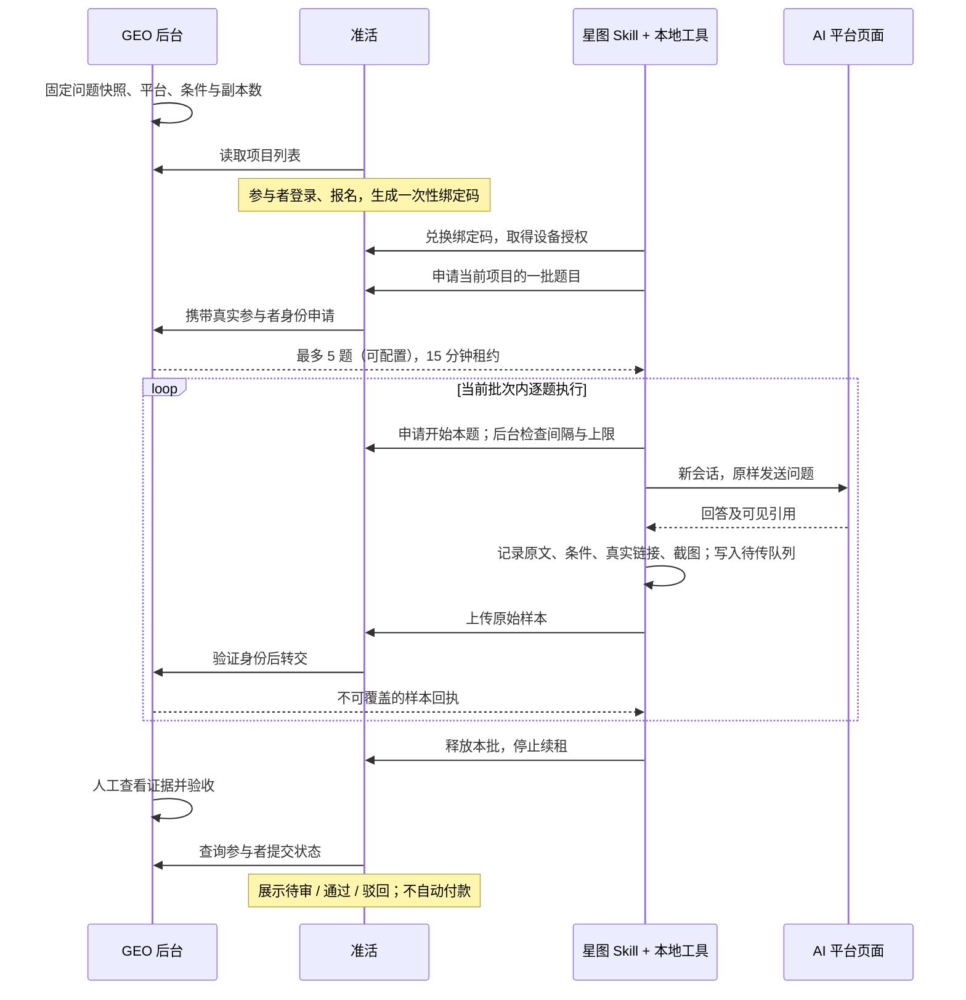

# GEO 众包 Agent：三端架构与第一版实现

本方案将现有 GEO 系统扩展为“后台定任务、准活组织人、星图执行采集”的协作系统。参与者不需要理解 GEO 指标，也不需要自己整理引用，只需报名、登录目标平台、开始任务，并在需要时处理登录或验证码。

本文区分已实现代码与尚待实机验证的能力。现有 Windows 守护进程保持原样，众包路径独立运行，原始样本不混入旧任务的覆盖式导入流程。

## 三端分别负责什么

GEO 是题目、配额和验收的唯一管理方。准活是参与者入口，复用已有账号，不另建众包网站。星图是执行工具，Skill 规定流程，本地 Python 客户端负责可靠传输；Skill 不能替代客户端自身的浏览器工具，也不会因为安装了就自动常驻运行。

## 从固定爬虫转向 Agent

旧路径是服务器脚本打开页面，再用平台专用的固定选择器寻找回答。页面结构变化时，原先的定位规则可能失效；集中运行也会积累账号与访问频率风险。

新路径由参与者授权在本机浏览器中执行。Agent 根据当前页面识别输入区、回答区和引用区，优先读取 DOM 文本与链接，遇到变化时借助截图、滚动和展开动作核对。这降低了对固定选择器的依赖，同时引入误识别、漏采与执行成本，因此需要保留原始证据、设置停止条件，并由后台验收。

众包并不代表账号可以无限使用，也不以换号绕过限制为目的。第一版按参与者与平台控制至少 90 秒的提问间隔、每小时最多 20 次开始采集；这是系统上限，并非任何平台承诺允许的额度。出现限制即停。DOM 变化由 Agent 尝试处理，不能判断完整性时必须标记不完整。

## 一次任务的数据流

参与者看到的是项目名称、平台、总题数、每批题数、项目编号和自己的提交状态。题目由系统分配，不需要回答“我选第几题到第几题”。同一参与者只保留一个有效批次；重复领取返回已有批次，断线不会随意多领。

同一道题需要多个副本时，分配给不同参与者。租约过期后未完成配额可以重新分配；迟交样本仍保存为 late，但不计入有效配额，避免它与重新分配的结果重复计数。

## 如何知道有任务，以及如何保证看得见

第一版通过准活首页的 GEO 采集入口查看任务。报名后在星图明确开始本批，Agent 每题报告当前问题与执行动作，参与者可要求停止。绑定只授予 GEO 接口权限，不授予准活其他业务权限。

当前网页提供项目和提交状态查询；离线推送、新任务订阅、星图自动唤醒尚未实现。它们后续应由准活通知系统与星图官方可用的启动机制承接，不能靠 Skill 自己“持续监听”。

可见的操作日志也不等于系统级隔离。第一版 Skill 要求仅操作任务页面；若要从权限层保证 Agent 无法操作其他页面或应用，需要星图运行时提供工具白名单与受限浏览器会话。此能力须实机确认。

## 一份合格样本包含什么

| 内容 | 处理原则 |
|---|---|
| 问题 | 必须与分配的快照完全一致 |
| 回答 | 保存页面原文，不用总结代替 |
| 引用 | 保存真实 URL、可见标题、引用标记，区分正文引用与搜索来源 |
| 引用状态 | complete、none_visible、incomplete 分开统计 |
| 条件 | 记录模型、联网状态、新会话、时间等；与项目要求核对 |
| 证据 | 页面原始文本和当前任务区域的 PNG/JPEG 截图 |
| 完整性 | 回答是否结束、引用是否展开、哪些字段无法确认 |
| 审计信息 | 参与者、分配编号、时间、内容摘要及独立验收记录 |

没有显示引用与未采集到引用是不同情况。不可读链接不能靠模型猜测。仅凭 URL 和截图无法证明参与者没有伪造；第一版采用人工复核，后续还需要交叉抽检、异常行为分析和可靠的运行记录。

后台对重复上传返回同一回执，对改写已提交原文返回错误。客户端断网时保留 outbox，恢复后重传已有样本，不重新向平台提问。验收不完整或采集条件不符的样本不能通过。

## 第一版代码落点

| 位置 | 功能 |
|---|---|
| GEO `backend/crowd_store.py` | 独立 SQLite 库、题目快照、串行事务分题、租约、节流、原始样本、验收日志 |
| GEO `backend/routers/crowd.py` | 管理员接口、准活专用服务网关 |
| GEO `/crowd` | 创建项目、导入当前题库、暂停/恢复、查看原始证据、验收 |
| 准活 `geo_crowd.py` | 报名、一次性绑定码、设备撤销、身份校验、安全代理 |
| 准活 `/geo/index.html` | 任务列表、报名、绑定和我的提交 |
| `skills/geo-crowd` | 星图 Skill、采集样本格式、本地绑定/续租/上传/重试工具 |

第一版没有把众包样本直接写入旧评分表：旧导入逻辑可能覆盖同一题目，且单账号与众包样本的采集条件不同。在完成采样口径确认后，应增加独立的众包统计报告，再决定怎样与旧报告并列展示。当前“通过”仅代表人工验收，不是质量评分或付款。

## 部署与验证边界

GEO 继续使用现有 Linux 后端；旧 Windows 守护进程不需要安装本组件。准活使用现有站点和数据库，新增三张身份/报名表，PostgreSQL 与本地 SQLite 均有对应兼容写法。

GEO 与准活之间必须走 HTTPS，或经 SSH 隧道访问本机回环端口。公网 HTTP 不允许携带集成密钥。用户的设备仅访问准活 HTTPS，不接触 GEO 服务密钥。设备令牌在服务端仅存摘要，Windows 本地使用当前用户 DPAPI 加密。

本地已验证真实 HTTP 的报名、绑定、分题、上传、验收回查流程，以及并发分配、身份隔离、重复上传、过期与撤销等边界。测试浏览器回答使用固定样本，不能替代真实 AI 平台采集。

2026-09-25 已部署两端服务，完成 PostgreSQL 隔离验证、生产建表、安全隧道与公开入口检查，详见 [部署记录](CROWD_DEPLOYMENT_20260925.md)。仍需验证星图 Skill 导入方式、浏览器工具权限、登录态保存、实际页面的完整采集与遇限流停止。拿到一组真实且验收通过的样本后，再扩大参与者与题量。
